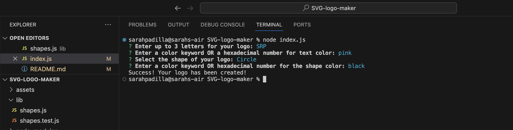
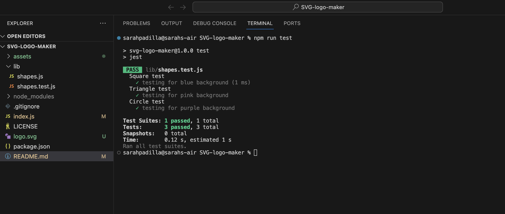
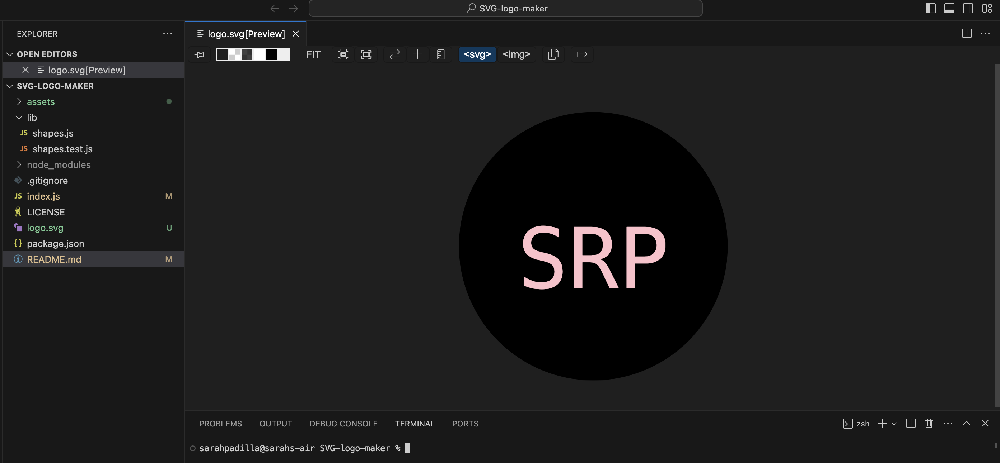

# SVG-logo-maker

## Description

Node.js command-line application that takes in user input to generate a logo and save it as an SVG file. The application prompts the user to select a color and shape, provide text for the logo, and save the generated SVG to a .svg file.

## User Story

As a freelance web developer
I want to generate a simple logo for my projects
So that I don't have to pay a graphic designer

## Acceptance Criteria

GIVEN a command-line application that accepts user input
WHEN I am prompted for text
THEN I can enter up to three characters
WHEN I am prompted for the text color
THEN I can enter a color keyword (OR a hexadecimal number)
WHEN I am prompted for a shape
THEN I am presented with a list of shapes to choose from: circle, triangle, and square
WHEN I am prompted for the shape's color
THEN I can enter a color keyword (OR a hexadecimal number)
WHEN I have entered input for all the prompts
THEN an SVG file is created named `logo.svg`
AND the output text "Generated logo.svg" is printed in the command line
WHEN I open the `logo.svg` file in a browser
THEN I am shown a 300x200 pixel image that matches the criteria I entered

## Installation

To install jest use 'npm i jest', and for inquirer use 'npm i inquirer@8.2.4' in terminal.

## Images

### Terminal Prompts

### Terminal Test

### SVG Logo Example

## Link to Video Walkthrough

**Video:** [Link](https://youtu.be/YB95vRNyzOw)

## Credits

Slack Overview

## License

